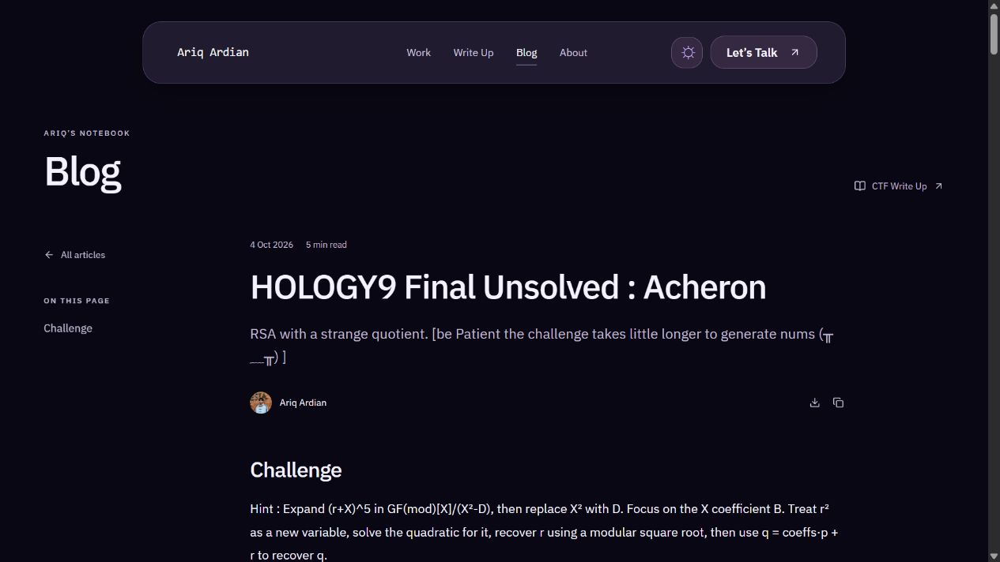

# Ariq Ardian — Portfolio & Blog

[Website](https://pocarikaleng.github.io/AriqArdianPorto/) · [Source](https://github.com/PocariKaleng/AriqArdianPorto)

Tulis artikel memakai editor web lokal. Artikel Published dan gambar unggahannya diekspor menjadi file di repository, lalu GitHub Actions membangun portfolio dan blog untuk GitHub Pages.



## 1. Buka editor lokal

Gunakan Node.js 22.13 atau lebih baru:

```powershell
npm run install:ci
npm run dev -- --hostname 127.0.0.1 --port 5174
```

Buka [editor lokal](http://127.0.0.1:5174/blog), klik **Owner sign in**, lalu **New article**. Sign-in ini memakai identitas simulasi khusus development di komputer sendiri.

Untuk checkout yang sudah dipakai menulis, database lokal tetap tersimpan di komputer. Untuk clone baru, siapkan database satu kali sebelum mulai menulis:

```powershell
npm run build
node --import ./scripts/sites-env.mjs ./node_modules/wrangler/bin/wrangler.js d1 execute DB --local --config dist/server/wrangler.json --persist-to .wrangler/state --file drizzle/0000_conscious_dakota_north.sql
```

Database dan gambar asli editor ada di `.wrangler/state/`, terpisah dari file artikel publik. Folder tersebut diabaikan Git; cadangkan secara pribadi bila perlu. File `content/blog/` dapat langsung dibangun pada clone baru tanpa database atau editor yang sedang berjalan.

## 2. Tulis, simpan, dan ekspor

- **Write** untuk menulis dengan toolbar dan menu `/`; **Markdown**, **Split**, dan **Preview** memakai isi yang sama.
- Gambar unggahan: PNG, JPEG, GIF, WebP, maksimal 8 MiB per gambar.
- Kode Python, Solidity, JavaScript, dan bahasa lain tetap mendapat syntax highlighting.
- LaTeX `$...$` dan `$$...$$` dirender; klik persamaan untuk menyalin sumber LaTeX.
- **Save draft** menyimpan tulisan pribadi. **Publish** menandai artikel agar masuk ekspor. **Update article** menyimpan revisi artikel Published. Ctrl/Cmd+S menyimpan dengan status saat ini.
- **Publish di editor lokal belum memperbarui website online.** Perubahan, penghapusan, dan unpublish baru muncul online setelah ekspor ulang dan deployment berhasil.

Biarkan editor berjalan. Di terminal kedua:

```powershell
npm run blog:prepare
```

Perintah ini mengambil semua artikel Published yang sudah tersimpan dari `http://127.0.0.1:5174`, menulis Markdown, metadata, dan gambar ke `content/blog/`, lalu membangun website di `static-site/`. Draf, akun, dan database tidak masuk hasil build.

Jika editor memakai port lain:

```powershell
npm run blog:prepare -- http://127.0.0.1:5175
```

Tombol **Export website** mengunduh paket `portfolio.blog.json` berisi **semua artikel Published yang sudah tersimpan dan gambar unggahannya**. Simpan perubahan sebelum menggunakannya. Paket dapat disiapkan tanpa editor yang sedang berjalan:

```powershell
npm run blog:prepare -- ".\portfolio.blog.json"
```

Ekspor adalah snapshot lengkap: artikel yang sudah dihapus/unpublish ikut hilang dari `content/blog/` pada ekspor berikutnya. Versi sebelumnya disimpan sebagai cadangan lokal di `.sites-runtime/blog-backup-*`. Gambar HTTPS dari situs lain tetap berupa tautan; unggah gambar melalui editor agar file gambarnya ikut paket.

## 3. Lihat hasil publik

```powershell
npm run preview:static
```

Buka [preview website publik](http://127.0.0.1:4173/blog/). Artikel punya URL sendiri di `/blog/<slug>/`, pencarian, daftar isi, copy kode, copy LaTeX, dan tombol berbagi tautan. Work, About, Contact, dan koleksi PDF Write Up tetap ikut website.

Untuk membangun ulang dari file yang sudah diekspor:

```powershell
npm run test:blog
npm run build:static
```

## 4. Terbitkan melalui GitHub Pages

Workflow tersedia di `.github/workflows/pages.yml`:

1. Masukkan source proyek ke repository GitHub tujuan, termasuk `content/blog/`, `public/`, script build, `package.json`, dan `package-lock.json`.
2. Di **Settings → Pages → Build and deployment → Source**, pilih **GitHub Actions**.
3. Push ke branch **main**, atau jalankan **Publish portfolio and blog** dari tab **Actions**.
4. Setelah job deploy sukses, buka URL Pages yang muncul di hasil workflow. Bagikan URL artikel dari tombol **Copy article link**.

Setelah menulis artikel berikutnya: **Publish/Update article → `npm run blog:prepare` → commit perubahan `content/blog/` → push**. GitHub membangun ulang dari snapshot tersebut; tidak menghubungi editor atau komputer lokal. Workflow menyesuaikan URL aset dengan subfolder repository dan membuat canonical/metadata sharing serta sitemap.

Folder `static-site/` adalah hasil build dan diabaikan Git. Workflow mengunggah folder itu sebagai artifact Pages. Tidak ada token, database cloud, R2, atau login online yang perlu disiapkan untuk alur statis ini.

Panduan resmi: [custom workflow GitHub Pages](https://docs.github.com/en/pages/getting-started-with-github-pages/using-custom-workflows-with-github-pages).

### Hasil pemeriksaan dependency

Pemeriksaan 4 Oktober 2026 setelah patch: `npm audit --omit=dev` melaporkan 0 advisory. Audit penuh masih melaporkan 18 dependency alat development terdampak (11 high, 7 moderate), termasuk tool Cloudflare, Vinext, lint/glob, dan migrasi. Paket alat tersebut tidak dikirim dalam artifact website statis. Sebagian memerlukan perubahan toolchain atau belum memiliki patch upstream; status ini belum dianggap audit menyeluruh yang bersih.

### Build lama untuk server

`npm run build` tetap membangun editor Vinext/Cloudflare ke `dist/` untuk kebutuhan database lokal atau hosting Sites. Build server ini bergantung pada gateway autentikasi Sites. Untuk website publik GitHub Pages, gunakan **`npm run build:static` dan artifact `static-site/`**.

## Struktur dan kebutuhan jaringan

| Folder | Isi |
| --- | --- |
| `content/blog/` | Snapshot artikel Published, Markdown, dan gambar |
| `components/blog/`, `app/`, `lib/` | Editor lokal, renderer artikel, dan API lokal |
| `public/` | Halaman portfolio, aset, widget, dan PDF Write Up |
| `scripts/` | Ekspor, validasi, build statis, dan preview |
| `.github/workflows/` | Build dan deployment GitHub Pages |

Editor memakai React/Vinext, TipTap, dan CodeMirror. Renderer artikel memakai React Markdown dan KaTeX; artifact publik berupa HTML, CSS, dan JavaScript. Font blog dan gambar unggahan disertakan dalam artifact. Halaman portfolio juga memakai Google Fonts; sampul musik mengambil gambar dari CDN Spotify. Tautan sosial, demo proyek, dan embed pihak ketiga memerlukan internet dan layanan asalnya.

## Referensi dan atribusi

Alur menulis lokal dan membagikan blog terinspirasi oleh [nayak4.dev](https://nayak4.dev/); proyek ini adalah portfolio pribadi Ariq Ardian. Lisensi font, ikon, serta kode vendor dipertahankan bersama asetnya. Sampul musik dan poster anime adalah referensi koleksi pribadi; hak atas karya tersebut tetap milik pemiliknya. Repository ini tidak menyertakan lisensi penggunaan ulang untuk keseluruhan proyek.
