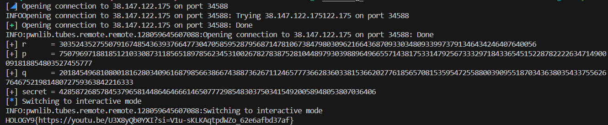

## Challenge

Hint : Expand (r+X)^5 in GF(mod)\[X\]/(X²-D), then replace X² with D. Focus on the X coefficient B. Treat r² as a new variable, solve the quadratic for it, recover r using a modular square root, then use q = coeffs·p + r to recover q.

Jadi pada challenge ini diberikan file berikut : 

```python
import os
from secrets import randbits, randbelow
from Crypto.Util.number import getPrime, isPrime

FLAG = os.getenv("FLAG", "HOLOGY9{REDACTED}")
e = 65537

def mul(a, b, m, D):
    x, y = a
    u, v = b
    return ((x*u + y*v*D) % m, (x*v + y*u) % m)

def pw(a, n, m, D):
    r = (1, 0)
    while n:
        if n & 1: r = mul(r, a, m, D)
        a = mul(a, a, m, D)
        n >>= 1
    return r

while True:
    p, coeffs = getPrime(512), getPrime(32)
    r = randbits(384) 
    q = coeffs*p + r
    if isPrime(q):
        break

n = p*q
secret = randbits(256)
c = pow(secret, e, n)

while True:
    mod = getPrime(521)
    if mod % 4 == 3:
        break

while True:
    D = randbelow(mod - 2) + 2
    if pow(D, (mod - 1)//2, mod) == mod - 1:
        break

A, B = pw((r, 1), 5, mod, D)

while True:
    print("[1] Challenge")
    print("[2] Submit")
    print("[3] Exit")
    x = input(">>> ")

    if x == "1":
        print(f"n = {n}")
        print(f"e = {e}")
        print(f"c = {c}")
        print(f"coeffs = {coeffs}")
        print(f"mod = {mod}")
        print(f"D = {D}")
        print(f"quotient = ({A}, {B})")
        print("R = GF(mod)[x]/(x^2-D)")
        print("quotient = (r+x)^5")

    elif x == "2":
        try:
            if int(input("secret?> ")) == secret:
                print(FLAG)
                break
        except:
            pass
        print("Wrong.")

    elif x == "3":
        break
```

yup disini bukan RSA biasa , di challenge ini terdapat tambahan variable yaitu coeffs , mod , D , dan Quotient.

Oke jika diliat dari Hint yang diberikan : Expand (r+X)^5 in GF(mod)\[X\]/(X²-D) . Maka disini target kita yang pertama itu Expand $(r+X)^5$ ini sama seperti rumus berikut : $(a+b)^5$ Maka kalo diturunkan Hasil nya akan menjadi berikut : 

$$
(r+X)^5 = r^5 + 5r^4X + 10r^3X^2 + 10r^2X^3 + 5rX^4 + X^5
$$

Dan selanjut nya Disini dari Hint beritau :  "then replace X² with D"

Karena di challenge Quotient Ring nya itu : $X^2 = D$

Maka bentuk persamaan nya menjadi : 

$$
X^3=DX, \quad X^4=D^2, \quad X^5=D^2X
$$

Jika disubtitusi : 

$$
r^5 + 5r^4X + 10Dr^3 + 10Dr^2X + 5D^2r + D^2X
$$

Lalu selanjutnya kelompokan menjadi seperti ini : 

$$
(r+X)^5 = \underbrace{r^5 + 10Dr^3 + 5D^2r}_{A} + \underbrace{(5r^4 + 10Dr^2 + D^2)}_{B}X
$$

Terus bagian A dan B di pisah karena apa wak? Jadi di pisahnya karena 

- tanpa $(X)$ masuk ke bagian $(A)$
- yang masih punya $(X)$ masuk ke bagian $(BX)$

Dan di Dapatkan bentuk Akhir nya seperti ini (Leak) : 

$$
A+BX
$$

Lalu sekarang lanjut kebagian Hint ini : "Focus on the X coefficient B" 

Karena sudah di dapatkan bentuk B seperti ini : 

$$
B=5r^4+10Dr^2+D^2
$$

Dan dari hint selanjut nya seperti ini : "Treat r² as a new variable" , jadi ya buat aja : 

$$
r^2=y
$$

Dari sini maka langsung saja kita subtitusikan dengan nilai dari B tadi , maka hasilnya akan menjadi seperti berikut : 

$$
B=5y^2+10Dy+D^2
$$

Hasil dari ini kita pindahkan ke satu sisi maka akan menjadi membentuk Persamaan kuadrat berikut : 

$$
5y^2+10Dy+D^2-B=0
$$

Bagian : $a = 5$ , $b = 10D$, $c = D^2 - B$
Nah ini sudah jadi persamaan kuadrat terhadap $y$ di $GF(mod)$. Disini kita sudah sampai ke bagian Hint : "solve the quadratic for it"

Jadi di kode Sage \[maff pake sage mint (╥﹏╥)\] Kita buat jadi berikut : 

```sage
F = GF(mod)

P.<y> = PolynomialRing(F)
f = 5*y^2 + 10*F(D)*y + F(D)^2 - F(B)
```

Lalu buat nyari semua akar $y$:

```sage
for y0 in f.roots(multiplicities=False):
    print(y0)
```

Karena tadi:

$$
y=r^2
$$

Dan jika mengikuti Hint : "recover r using a modular square root"

Berarti cari square root, dari setiap y0:

```sage
for y0 in f.roots(multiplicities=False):
    for r in y0.sqrt(all=True, extend=False):
        print(r)
```

Karena possible muncul beberapa kandidat r, jadi verifikasi langsung ke leak asli:

```sage
r_candidates = []

for y0 in f.roots(multiplicities=False):
    for r in y0.sqrt(all=True, extend=False):
        if Q(r + X)^5 == leak:
            r_candidates.append(ZZ(r))
```

Oke karena di sini bagian r sudah dapat disini kita mencari nilai q.
$$
q=\text{coeffs}\cdot p+r
$$
Dan chall kita bentuk RSA standar dengan N sudah diberitau : $N = p * q$
maka ganti q dengan bentuk tadi:
$$
n=p(\text{coeffs}\cdot p+r)
$$
Dan karena masih bisa di expand kita coba expand dan hasil nya berikut:
$$
n=\text{coeffs}\cdot p^2+rp
$$
Dan disini pindahin semua nya kesatu sisi hasilnya berikut:
$$
\text{coeffs}\cdot p^2+rp-n=0
$$
bentuknya sudah jadi persamaan kuadrat terhadap p:
$$
ap^2+bp+c=0
$$
dengan: $a=\text{coeffs}$, $b=r$, $c=-n$
Lalu hitung diskriminan nya:
$$
\Delta=b^2-4ac
$$
jadi:
$$
\Delta=r^2+4\cdot\text{coeffs}\cdot n
$$
Jadi di kode bisa kita implements seperti ini:
```sage
delta = r^2 + 4*coeffs*n
```
Karena p bilangan bulat, delta harus perfect square:
```sage
if delta.is_square():
```
Terus pakai rumus kuadrat:
$$
p=
\frac{-r+\sqrt{\Delta}}
{2\cdot\text{coeffs}}
$$
Implement kode nya :
```sage
p = (-r + delta.sqrt()) // (2*coeffs)
```
Habis dapat p nya ya tinggal hitung gini aja sih.
$$
q=\frac{n}{p}
$$

Sisa nya sih decrypt RSA biasa buat Recover nilai Secretnya , dan berikut Final solver script.
Solver.sage
```sage
from sage.all import *
from pwn import *

conn = remote('38.147.122.175',34588)
conn.sendlineafter(b"> ", b"1")

n = int(conn.recvline_contains(b"n = ").split(b" = ")[1])
e = int(conn.recvline_contains(b"e = ").split(b" = ")[1])
c = int(conn.recvline_contains(b"c = ").split(b" = ")[1])
coeffs = int(conn.recvline_contains(b"coeffs = ").split(b" = ")[1])
mod = int(conn.recvline_contains(b"mod = ").split(b" = ")[1])
D = int(conn.recvline_contains(b"D = ").split(b" = ")[1])
line = conn.recvline_contains(b"quotient = ")
A, B = map(int, line.split(b"(")[1].rstrip(b")\n").split(b","))

F = GF(mod)
R.<x> = PolynomialRing(F)
Q.<X> = R.quotient(x^2 - F(D))
leak = Q(F(A) + F(B)*X)
P.<y> = PolynomialRing(F)
f = 5*y^2 + 10*F(D)*y + F(D)^2 - F(B)

r_candidates = []
for y0 in f.roots(multiplicities=False):
    for r in y0.sqrt(all=True, extend=False):
        if Q(r + X)^5 == leak:
            r_candidates.append(ZZ(r))

p = q = None

for r in r_candidates:
    delta = r^2 + 4*coeffs*n
    if delta.is_square():
        p = (-r + delta.sqrt()) // (2*coeffs)
        q = n // p
        break

assert p*q == n

phi = (p - 1) * (q - 1)
d = pow(int(e), -1, int(phi))
secret = pow(int(c), d, int(n))
print(f"[+] r      = {r}")
print(f"[+] p      = {p}")
print(f"[+] q      = {q}")
print(f"[+] secret = {secret}")

conn.sendlineafter(b"> ", b"2")
conn.sendlineafter(b"secret?> ", str(secret).encode())
conn.interactive()
```



```txt
HOLOGY9{https://youtu.be/U3X8yQb0YXI?si=V1u-sKLKAqtpdWZo_62e6afbd37af}
```